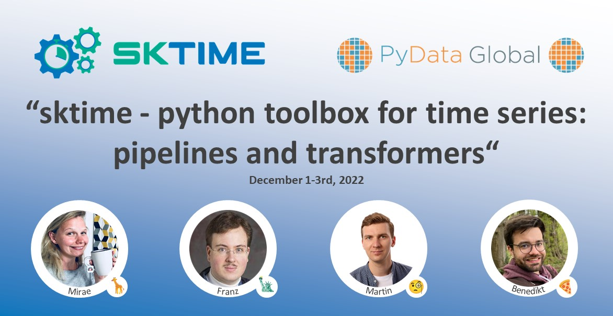

Welcome to the sktime tutorial at PyData Global 2022
====================================================

This tutorial is about [sktime] - a unified framework for machine learning with time series. sktime features various time series algorithms and modular tools for sktime is a widely used scikit-learn compatible library for learning with time series. sktime is easily extensible by anyone, and interoperable with the pydata/numfocus stack. 

This `sktime` tutorial explains **basic and advanced sktime pipeline constructs, and the time series transformer** which is the main component in all types of pipelines.

[sktime]: https://sktime.org

Also recommended:

:movie_camera: **[general sktime intro tutorial](https://github.com/sktime/sktime-tutorial-pydata-global-2021) from PyData Global 2021**\
:tv: [youtube video of sktime intro at PyData Global 2021](https://www.youtube.com/watch?v=ODspi8-uWgo)

### Agenda

- We will move through each of the numbered chapters in this repo section by section.
- You should be able to follow along out of the box on Binder.
- Please let us know on slack if you have any issues following along during the synchronous tutorial, or join our community on [sktime slack](https://join.slack.com/t/sktime-group/shared_invite/zt-1jphqjpnk-AfxAR8IEfIVkf4By8cT7tQ) to ask for help if you are walking through this tutorial asynchrounously.

### Content

In time series analysis, often multiple, sometimes repetitive, algorithmic steps are applied to the data. Organising these steps in a clear way to enable flexible deployment on multiple data sets and easily reproduce results. Pipelines offer a solution to this challenge by providing a structure to build flexible sequences of applying time series algorithms. The modular building blocks of pipelines are "transformers" or "transformations" (in the scikit-learn sense) as well as estimators specific to learning tasks, such as forecasters or time series classifiers. The challenge in learning with time series are the many different types of transformations, such as:

*  transformers of a time series to time series, e.g., differencing and detrending
* transformers of a time series to a row of primitive features/valus in a data frame, e.g., time series summary
* transformers of a time series to a panel of time series, e.g., bootstrap, sliding window
* transformers that apply to hierarchical time series, e.g., reconciliation or hierarchical aggregation
* transformers of a pair of time series to a real number, e.g., time series distances or kernels

sktime provides a framework to distinguish the above, and to use transformers of the various types as components in different types of pipelines, such as:

* forecasting pipelines, with transformers applied to endogeneous, exogeneous, or output data,
* time series classification pipelines, with transformers applied to inputs,
* compositor pipelines for time series distances or parameter estimators,
* specialized reduction steps consuming different types of transformers and machine learning estimators, 
* and many more.

The design challenge is to formalize transformers in a way that a given type of transformer can be used in multiple types of pipeline, and creating pipelines that can use multipe types of transformers. sktime solves this challenge through the "scientific type" formalism which applies object orientation based typing to the transformers and inputs/outputs.  The presentation will also briefly touch on advanced pipelining concepts such as graph pipelines and roadmap items inviting contributions.

## Other Video Tutorials:

- [PyData 2021 - Intro to sktime](https://www.youtube.com/watch?v=ODspi8-uWgo)

- [Pydata 2022 - How to implement your own estimator in sktime](https://www.youtube.com/watch?v=S_3ewcvs_pg)

- [Pydata 2022 - Advanced Forecasting Tutorial](https://www.youtube.com/watch?v=4Rf9euAhjNc)
